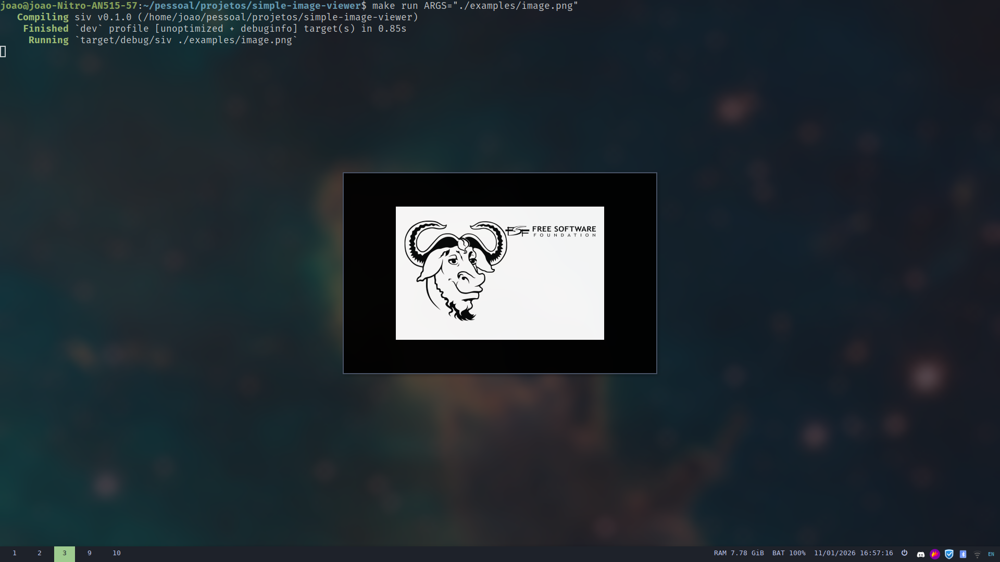

# simple-image-viewer (siv)

<p align="center">
  
  
  
</p>

<p align="center">
  <strong>Um visualizador de imagens simples, feito em Rust.</strong><br/>
  Projeto pequeno, focado em aprendizado e experimentação.
</p>

<p align="center">
  
</p>

---

## Sobre

O **simple-image-viewer (siv)** é um projeto **experimental**, criado com o objetivo de estudar:

- Estruturação de projetos em Rust
- Criação de aplicações desktop simples
- Event loop e janelas
- Renderização básica de imagens

> **Aviso**  
> Este projeto **não é um visualizador completo** e **não tem como objetivo competir** com ferramentas reais.  
> Ele existe apenas como exercício de aprendizado.

---

## O que ele faz (v0)

- Abre uma janela nativa
- Carrega uma imagem a partir do caminho passado por argumento
- Renderiza a imagem na tela
- Fecha ao clicar no botão de fechar da janela

Nada além disso. Simples e direto.

---

## Uso

### Via Cargo

```bash
cargo run -- ./caminho/para/imagem.png
```

### Via Makefile

```bash
make run ARGS="./caminho/para/imagem.png"
```

Ou em release:

```bash
make release
./target/release/siv ./caminho/para/imagem.png
```

---

## Exemplo

```bash
make run ARGS="./examples/image.png"
```

---

## Licença

Este projeto é licenciado sob a
**GNU General Public License v3.0 (GPL-3.0)**.

Consulte o arquivo `LICENSE` para mais detalhes.
